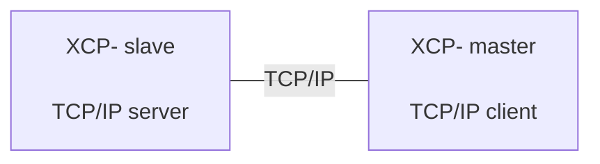

# XCP Version 1.1 - Part 3: Transport Layer Specification  
## XCP on Ethernet (TCP/IP and UDP/IP)

**Association for Standardisation of Automation and Measuring Systems (ASAM)**  
**Date:** 31-03-2008  
**Status:** Release

> Source: ASAM XCP Version 1.1, Part 3 - Transport Layer Specification, XCP on Ethernet (TCP/IP and UDP/IP).

---

## Status of Document

| Field | Value |
|---|---|
| Date | 31-03-2008 |
| Authors | Roel Schuermans, Vector Informatik GmbH; Andreas Zeiser, Vector Informatik GmbH; Oliver Kitt, Vector Informatik GmbH; Hans-Georg Kunz, VDO Automotive AG; Hendirk Amsbeck, dSPACE GmbH; Bastian Kellers, dSPACE GmbH; Boris Ruoff, ETAS GmbH; Reiner Motz, Robert Bosch GmbH; Dirk Forwick, Robert Bosch GmbH |
| Version | Version 1.1 |
| Status | Release |

### Disclaimer of Warranty

Although this document was created with the utmost care it cannot be guaranteed that it is completely free of errors or inconsistencies.

ASAM e.V. makes no representations or warranties with respect to the contents or use of this documentation, and specifically disclaims any expressed or implied warranties of merchantability or fitness for any particular purpose. Neither ASAM nor the author(s) therefore accept any liability for damages or other consequences that arise from the use of this document.

ASAM e.V. reserves the right to revise this publication and to make changes to its content, at any time, without obligation to notify any person or entity of such revisions or changes.

<!-- Source page: 2 -->

---

## Revision History

This revision history shows only major modifications between release versions.

| Date | Author | Filename | Comments |
|---|---|---|---|
| 2008-03-31 | R. Schuermans |  | Released document |

<!-- Source page: 3 -->

---

## Table of Contents

- [0 Introduction](#0-introduction)
  - [0.1 The XCP Protocol Family](#01-the-xcp-protocol-family)
  - [0.2 Documentation Overview](#02-documentation-overview)
  - [0.3 Definitions and Abbreviations](#03-definitions-and-abbreviations)
  - [0.4 Mapping between XCP Data Types and ASAM Data Types](#04-mapping-between-xcp-data-types-and-asam-data-types)
- [1 The XCP Transport Layer for Ethernet (TCP/IP and UDP/IP)](#1-the-xcp-transport-layer-for-ethernet-tcpip-and-udpip)
  - [1.1 Addressing](#11-addressing)
  - [1.2 Communication Model](#12-communication-model)
  - [1.3 Header and Tail](#13-header-and-tail)
    - [1.3.1 Header](#131-header)
    - [1.3.1.1 Length](#1311-length)
    - [1.3.1.2 Counter](#1312-counter)
    - [1.3.2 Tail](#132-tail)
  - [1.4 The Limits of Performance](#14-the-limits-of-performance)
- [2 Specific Commands for XCP on Ethernet](#2-specific-commands-for-xcp-on-ethernet-tcpip-and-udpip)
- [3 Specific Events for XCP on Ethernet](#3-specific-events-for-xcp-on-ethernet-tcpip-and-udpip)
- [4 Interface to ASAM MCD 2MC Description File](#4-interface-to-asam-mcd-2mc-description-file)
  - [4.1 ASAM MCD 2MC AML for XCP on Ethernet](#41-asam-mcd-2mc-aml-for-xcp-on-ethernet-tcpip-and-udpip)
  - [4.2 IF_DATA Example for XCP on Ethernet](#42-if_data-example-for-xcp-on-ethernet-tcpip-and-udpip)

### Table of Diagrams

- Diagram 1: RESUME mode with TCP/IP - source page 11
- Diagram 2: Header and Tail for XCP on Ethernet (TCP/IP and UDP/IP) - source page 13

<!-- Source pages: 5-6 -->

---

# 0 Introduction

## 0.1 The XCP Protocol Family

This document is based on experiences with the CAN Calibration Protocol (CCP) version 2.1 as described in feedback from the companies Accurate Technologies Inc., Compact Dynamics GmbH, DaimlerChrysler AG, dSPACE GmbH, ETAS GmbH, Kleinknecht Automotive GmbH, Robert Bosch GmbH, Siemens VDO Automotive AG and Vector Informatik GmbH.

The XCP Specification documents describe an improved and generalized version of CCP.

The generalized protocol definition serves as standard for a protocol family and is called **XCP (Universal Measurement and Calibration Protocol)**.

The “X” generalizes the various transportation layers used by members of the protocol family, e.g.: “XCP on CAN“，”XCP on TCP/IP“，“XCP on UDP/IP，“XCP on USB“ and so on.

<!-- Source page: 7 -->

---

## 0.2 Documentation Overview

The XCP specification consists of five parts. Each part is a separate document and has the following content:

1. **Part 1 - Overview**  
   Gives an overview of the XCP protocol family, XCP features and the fundamental protocol definitions.

2. **Part 2 - Protocol Layer Specification**  
   Defines the generic protocol, which is independent from the transportation layer used.

3. **Part 3 - Transport Layer Specification**  
   Defines how the XCP protocol is transported by a particular transport layer such as CAN, TCP/IP and UDP/IP.  
   **This document describes XCP over Ethernet using TCP/IP and UDP/IP.**

4. **Part 4 - Interface Specification**  
   Defines interfaces from an XCP master to an ASAM MCD 2MC description file and interfaces for calculating Seed & Key algorithms and checksums.

5. **Part 5 - Example Communication Sequences**  
   Gives example sequences for typical actions performed with XCP.

  Everything not explicitly mentioned in this document should be considered implementation-specific.

<!-- Source page: 8 -->

---

## 0.3 Definitions and Abbreviations

  The following table gives an overview about the most commonly used definitions and abbreviations throughout this document.

| Abbreviation | Description |
|---|---|
| A2L | File Extension for an ASAM 2MC Language File |
| AML | ASAM 2 Meta Language |
| ASAM | Association for Standardization of Automation and Measuring Systems |
| BYP | BYPassing |
| CAL | CALibration |
| CAN | Controller Area Network |
| CCP | CAN Calibration Protocol |
| CMD | CoMmanD |
| CS | CheckSum |
| CTO | Command Transfer Object |
| CTR | CounTeR |
| DAQ | Data AcQuisition, Data AcQuisition Packet |
| DTO | Data Transfer Object |
| ECU | Electronic Control Unit |
| ERR | ERRor Packet |
| EV | EVent Packet |
| LEN | LENgth |
| MCD | Measurement Calibration and Diagnostics |
| MTA | Memory Transfer Address |
| ODT | Object Descriptor Table |
| PAG | PAGing |
| PGM | ProGraMming |
| PID | Packet IDentifier |
| RES | command RESponse packet |
| SERV | SERVice request packet |
| SPI | Serial Peripheral Interface |
| STD | STanDard |
| STIM | Data STIMulation packet |
| TCP/IP | Transfer Control Protocol / Internet Protocol |
| TS | Time Stamp |
| UDP/IP | Unified Data Protocol / Internet Protocol |
| USB | Universal Serial Bus |
| XCP | Universal Calibration Protocol |

<!-- Source page: 9 -->

---

## 0.4 Mapping between XCP Data Types and ASAM Data Types

The following table defines the mapping between data types used in this specification and ASAM data types defined by Project Data Harmonization Version 2.0.

| XCP Data Type | ASAM Data Type |
|---|---|
| BYTE | A_UINT8 |
| WORD | A_UINT16 |
| DWORD | A_UINT32 |
| DLONG | A_UINT64 |

<!-- Source page: 10 -->

---

# 1 The XCP Transport Layer for Ethernet (TCP/IP and UDP/IP)

## 1.1 Addressing

A slave device connected by Ethernet and TCP/IP or UDP/IP is addressed by its  IP Address and Port number.

### TCP/IP

The slave device is the **listener**. It will only accept one connection at a time.

If the socket is closed while in XCP connected state, the slave device will perform an XCP disconnect, which means that all data acquisition will be stopped.

#### Note for RESUME Mode



​                                      **Diagram 1: RESUME mode with TCP/IP**

For TCP/IP the XCP master always has to actively establish a connection to the XCP slave, which is passively listening for incoming connections until then. The consequence for RESUME mode is that the master has to permanently try to open a connection to the slave which itself has to buffer measurement data until the connection is established. Otherwise data will be lost.

### UDP/IP

While not connected, the slave device will answer upon a `CONNECT` command by sending the response to the IP address and port of the sender of the command.

It will continue to answer to this IP address and port for all subsequent responses.

When connected, it will respond only to telegrams from the IP address which has sent the `CONNECT` command, even if another port is used.

All other command packets will not be responded to.

<!-- Source page: 11 -->

---

## 1.2 Communication Model

XCP on TCP/IP and UDP/IP makes use the **standard communication model**.

- The Block transfer communication is optional.
- The Interleaved communication model is optional.

<!-- Source page: 12 -->

---

## 1.3 Header and Tail

XCP on Ethernet (TCP/IP and UDP/IP) Message
┌────────────────┬───────────────────────────────────────────┐
│   XCP Header                    │                 XCP Packet                                                                                │        
├────────┬───────┼─────┬──────┬──────┬─────────────┬─────────┤
│  LEN             │  CTR           │ PID       │     FILL    │       DAQ  │ TIMESTAMP             │  DATA             │
└────────┴───────┴─────┴──────┴──────┴─────────────┴─────────┘
 <--Control Field -> <------------- Length (LEN) ---------------------------------------------------------------------->

XCP Tail: empty for Ethernet

**Diagram 2: Header and Tail for XCP on Ethernet (TCP/IP and UDP/IP)**

Conceptually, an XCP-on-Ethernet frame is:

```text
+---------------- XCP Header ----------------+----------- XCP Packet -----------+
|            LEN             |      CTR      | PID | FILL | DAQ | TS | DATA ... |
+----------------------------+---------------+-----+------+-----+----+----------+

XCP Tail: empty for Ethernet (TCP/IP and UDP/IP)
```

<!-- Source page: 13 -->

### 1.3.1 Header

For XCP on Ethernet (TCP/IP and UDP/IP), the Header consists of a Control Field containing:

- **LENgth (LEN)**
- **CounTeR (CTR)**

Both `LEN` and `CTR` always are WORDs in Intel format.

To make optimal use of UDP/IP, multiple XCP Frames may be combined into a single UDP/IP frame, but an XCP Frame may not cross a UDP/IP frame boundary.

The same XCP Frame format is used for the stream oriented protocol TCP/IP to simplify decoding the original XCP messages.

#### 1.3.1.1 Length

`LEN` is the number of bytes in the original XCP Packet.

#### 1.3.1.2 Counter

The `CTR` value in the XCP Header allows detection of missing packets.

The **master** has to generate a CTR value for all packets sent to the slave. This CTR value is increased for each packet regardless of type, including:

- CMD
- STIM

The **slave** has to generate a (second, independent)  CTR value for all packets that are sent to the master. This CTR value is to be increased for each packet regardless of type, including:

- RES
- ERR / EV
- SERV
- DAQ

<!-- Source page: 13 -->

---

### 1.3.2 Tail

For XCP on Ethernet (TCP/IP and UDP/IP), there is **no Tail**.

The Control Field corresponding to the Tail is empty.

<!-- Source page: 14 -->

---

## 1.4 The Limits of Performance

The upper limit of `MAX_CTO` and `MAX_DTO` depends on the TCP/IP or UDP/IP protocol stack of the host system.

| Name | Type | Representation / Range |
|---|---|---|
| MAX_CTO | Parameter BYTE | 0x08 - 0xFF |
| MAX_DTO | Parameter WORD | 0x0008 - 0xFFFF |

<!-- Source page: 15 -->

---

# 2 Specific Commands for XCP on Ethernet (TCP/IP and UDP/IP)

There are **no specific commands** for XCP on Ethernet (TCP/IP and UDP/IP) at the moment.

<!-- Source page: 16 -->

---

# 3 Specific Events for XCP on Ethernet (TCP/IP and UDP/IP)

There are **no specific events** for XCP on Ethernet (TCP/IP and UDP/IP) at the moment.

<!-- Source page: 17 -->

---

# 4 Interface to ASAM MCD 2MC Description File

The following chapter describes parameters specific to:

- XCP on TCP/IP
- XCP on UDP/IP

<!-- Source page: 18 -->

---

## 4.1 ASAM MCD 2MC AML for XCP on Ethernet (TCP/IP and UDP/IP)

### TCP/IP AML

```c
/************************************************************************************/
/*                                                                                  */
/* ASAP2 meta language for XCP on TCP_IP V1.0                                      */
/*                                                                                  */
/* 2003-03-03                                                                       */
/*                                                                                  */
/* Vector Informatik, Schuermans                                                    */
/*                                                                                  */
/* Datatypes:                                                                       */
/*                                                                                  */
/* A2ML ASAP2 Windows description                                                   */
/* -------------------------------------------------------------------------------- */
/* uchar UBYTE BYTE unsigned 8 Bit                                                  */
/* char  SBYTE char signed 8 Bit                                                    */
/* uint  UWORD WORD unsigned integer 16 Bit                                         */
/* int   SWORD int signed integer 16 Bit                                            */
/* ulong ULONG DWORD unsigned integer 32 Bit                                        */
/* long  SLONG LONG signed integer 32 Bit                                           */
/* float FLOAT32_IEEE float 32 Bit                                                  */
/************************************************************************************/

/************************ start of TCP_IP ***********************************/

struct TCP_IP_Parameters {        /* at MODULE */
    uint;                         /* XCP on TCP_IP version */
                                  /* e.g. "1.0" = 0x0100 */
    uint;                         /* PORT */
    taggedunion {
        "HOST_NAME" char[256];
        "ADDRESS"   char[15];
    };
};

/************************* end of TCP_IP ************************************/
```

<!-- Source page: 18 -->

### UDP/IP AML

```c
/************************************************************************************/
/*                                                                                  */
/* ASAP2 meta language for XCP on UDP_IP V1.0                                      */
/*                                                                                  */
/* 2003-03-03                                                                       */
/*                                                                                  */
/* Vector Informatik, Schuermans                                                    */
/*                                                                                  */
/* Datatypes:                                                                       */
/*                                                                                  */
/* A2ML ASAP2 Windows description                                                   */
/* -------------------------------------------------------------------------------- */
/* uchar UBYTE BYTE unsigned 8 Bit                                                  */
/* char  SBYTE char signed 8 Bit                                                    */
/* uint  UWORD WORD unsigned integer 16 Bit                                         */
/* int   SWORD int signed integer 16 Bit                                            */
/* ulong ULONG DWORD unsigned integer 32 Bit                                        */
/* long  SLONG LONG signed integer 32 Bit                                           */
/* float FLOAT32_IEEE float 32 Bit                                                  */
/************************************************************************************/

/************************** start of UDP_IP ************************************/

struct UDP_IP_Parameters {        /* at MODULE */
    uint;                         /* XCP on UDP_IP version */
                                  /* e.g. "1.0" = 0x0100 */
    uint;                         /* PORT */
    taggedunion {
        "HOST_NAME" char[256];
        "ADDRESS"   char[15];
    };
};

/*************************** end of UDP_IP *************************************/
```

<!-- Source page: 19 -->

---

## 4.2 IF_DATA Example for XCP on Ethernet (TCP/IP and UDP/IP)

```a2l
/begin XCP_ON_TCP_IP
    0x0100          /* XCP on TCP_IP version */
    0x5555          /* PORT */
    "127.0.0.1"     /* ADDRESS */
/end XCP_ON_TCP_IP

/begin XCP_ON_UDP_IP
    0x0100          /* XCP on UDP_IP version */
    0x5555          /* PORT */
    "127.0.0.1"     /* ADDRESS */
/end XCP_ON_UDP_IP
```

<!-- Source page: 20 -->

---

# Appendix: Quick Engineering Reference

## Ethernet Transport Header

```text
Offset  Size  Field
0       2     LEN (WORD, Intel/little-endian)
2       2     CTR (WORD, Intel/little-endian)
4       LEN   Original XCP Packet
```

The Ethernet-specific XCP transport therefore adds a **4-byte transport header** before the Protocol Layer packet.

## TCP/IP Connection Behavior

```text
XCP Master = TCP client
XCP Slave  = TCP server/listener
```

- Slave accepts one connection at a time.
- Closing the socket while XCP is connected causes XCP disconnect.
- In RESUME mode the master must reconnect actively.
- Slave may need to buffer DAQ data until the TCP connection exists.

## UDP/IP Connection Behavior

Before XCP connection:

```text
CONNECT request source IP:port
            ↓
Slave sends response to that IP:port
```

After connection:

- Slave binds the XCP session logically to the IP address that issued `CONNECT`.
- Other command sources are ignored.

## UDP/IP Packing Rule

Multiple XCP Frames may be placed in one UDP datagram, but:

> One XCP Frame must never cross a UDP/IP datagram boundary.

## Frame Loss Detection

Master and Slave maintain **independent CTR sequences**:

```text
Master → Slave : CTR_M
Slave  → Master: CTR_S
```

Each counter increments for every transport packet in its direction, independent of XCP packet type.

---

# Document End

ASAM e.V.  
Arnikastraße 2  
D-85635 Höhenkirchen  
Germany
